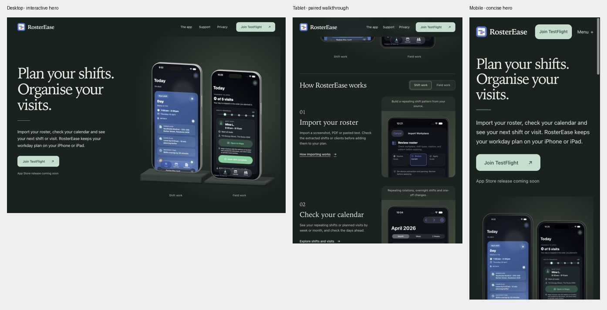

# RosterEase performance and UX pass — 1 October 2026

Implemented on `codex/performance-layout-pass`, based on `4b965c2`. Changes are local and uncommitted. The public GitHub Pages site has not been deployed. The font and token layer is byte-for-byte unchanged.

The largest observed problem was initialization of three WebGL walkthrough scenes during the first scroll. Those scenes added work without helping people read the screenshots. The walkthrough now uses upright screenshots; the desktop hero retains its interactive phones.

## Measured results

These are local Chromium observations, not field Core Web Vitals or physical-device benchmarks. “Frame gap” means the interval between requestAnimationFrame callbacks; it is a useful jank signal, not a measurement of GPU presentation time. Each initial-load window lasts 10 seconds and each interaction sample lasts 8 seconds.

| Scenario / asset | Before | After |
| --- | --- | --- |
| Desktop first scroll: largest frame gap | 258.3ms | 33.3ms and 74.9ms in two runs |
| Desktop first scroll: main-thread tasks >50ms | 4, largest 478ms | 0 in both runs |
| Desktop canvases after entering walkthrough | 4 | 1, hero only |
| Desktop initial load: largest frame gap | 182.6ms | 41.7ms and 75ms |
| Desktop initial load: tasks >50ms | 6 | 0 and 1 (75ms) |
| Desktop flick: largest frame gap | 15.8ms | 17.5ms; no tasks >50ms |
| 390px mobile initial load: largest frame gap | 82.4ms | 25ms; no tasks >50ms |
| Mobile hero images, DPR 1 | 96,280 bytes | 40,206 bytes, 58.2% smaller |
| JavaScript gzip, core + deferred 3D | 9,058 + 167,837 bytes | 10,208 + 157,877 bytes |

The flick was already inexpensive; its new easing follows elapsed time so it behaves consistently across refresh rates. The substantive improvement is avoiding walkthrough scene creation. The repeated 74.9ms scroll gap means this is not a claim that every frame meets a 16.7ms budget.

Raw comparisons: [baseline initial load](desktop-initial-load.json), [baseline first scroll](desktop-sample-2.json), [final initial load](final-desktop-initial-load.json), [final first scroll](final-desktop-sample-1.json), [repeat load](final-motion-initial-load.json), [repeat scroll](final-motion-sample-2.json), [final flick](final-motion-sample-1.json), [baseline mobile](mobile-390-initial-load.json), [final mobile](final-mobile-initial-load.json), [tablet](final-tablet-initial-load.json).

## Reviewed path and changes

1. **Desktop landing and first scroll — improved.** The retained hero waits for initial images and window load, then enhances during idle time. Shader compilation runs before the canvas is revealed. It renders on demand, settles to idle after a flick, and suspends when offscreen or the document is hidden. The walkthrough uses three flat screenshots, eliminating three WebGL contexts and their procedural geometry. Completed crossfade ghosts are released, including when a worker switch interrupts a previous switch. See [live desktop](01-live-desktop.png) and [final desktop](17-final-desktop.png).

2. **Tablet portrait and landscape — improved.** At 768px the hero stacks with larger screens; walkthrough steps pair copy and image in three horizontal rows. At 1024px the hero retains two columns. Setup help moves below the privacy copy instead of occupying a cramped side column. No horizontal overflow was found at the checked breakpoints. See [live tablet](02-live-tablet.png), [final portrait](07-final-tablet.png), [walkthrough](08-final-tablet-story.png) and [landscape](13-final-tablet-landscape.png).

3. **Mobile landing and app details — improved.** The smaller heading leaves more room for the value proposition and CTA while retaining the existing typeface. Responsive image sources let the browser choose 320, 480 or 640px previews. At 390px/DPR 1 the two hero images selected 320px files; higher-DPR devices can select larger files. iPad screenshots on `/app/` stack at mobile widths and have larger source options. The 320px page reflows without horizontal scrolling; its primary CTA remains available. See [live mobile](03-live-mobile.png), [final mobile](09-final-mobile.png), [iPad preview](11-final-mobile-ipad.png) and [320px](12-final-narrow.png).

4. **Worker choice, screenshots and appearance — working in checked states.** Mouse and keyboard worker changes, including rapid reversals, end with the correct content and no retained ghost nodes. The selector and page headings stay in position during the captured mobile crossfade. Enlarging a screenshot removes its small responsive source list, retains the visible preview during decode, and loads the full 1206px image. Escape closes the dialog and returns focus to its link. The mobile menu and appearance panel also close with Escape and restore focus. Light, dark and system choices update picture media; the dark choice persists through reload. See [full screenshot dialog](10-final-mobile-dialog.png).

5. **Page navigation, help, support and privacy — improved loading; checked paths work.** Public `/app`, `/contact` and `/help/smart-import` requests returned 301 redirects to slash URLs. Internal page links, canonical URLs and the sitemap now use the destination directly. Main navigation and walkthrough links opt into Astro prefetch on intent. The installed prefetch implementation respects data saver and slow connections. Current-page indicators still work. The privacy index now sits at 112px, below the 88px sticky header. Support → help and mobile menu → app paths were exercised. See [privacy index](14-final-privacy.png), [support](15-final-support.png), [help](16-final-help.png) and [live response headers](github-pages-headers.json).

## Motion evidence and limits

[Desktop flick video](final-hero.mp4) and [mobile switch video](worker-switch.mp4) package actual sequential browser screenshots with their capture timing. Original PNGs and timestamps are retained in `final-hero-capture.json` and `worker-switch-capture.json`. All decoded frames were inspected in [hero contact sheet](final-hero-video-contact.png) and [worker contact sheet](worker-switch-video-contact.png).

The hero makes one full turn and settles; the other phone, header and copy remain fixed. Worker frames 0–4 show the selected state and screenshot changing, followed by a stable endpoint through frame 15. No unexpected clipping or anchor movement was observed in those captured frames.

These are sparse captures, approximately 9.4fps and 12.9fps according to ffprobe, with variable intervals. They support sequencing and endpoint checks, not a certification of smoothness or absence of single-frame defects. The videos contain 20 frames at 1280×720 and 16 frames at 390×844; metadata is in `final-hero-video.json` and `worker-switch-video.json`. Runtime frame samples provide the separate timing evidence.

## Verification

- `npm run check:a11y`: build and static accessibility, local-link, asset, sitemap and light/dark contrast checks pass for all 12 pages. The new slash-URL regression guard was also checked by inserting a redirecting link into a disposable built page: it failed as expected, then passed after restoration.
- `npm run check:motion`: all three existing rotation tests pass.
- `tsc --noEmit` and `git diff --check`: pass.
- Token/font definitions compared against HEAD: unchanged. No dependency or package-lock changes.
- Responsive widths checked: 320, 360, 390, 720, 721, 768, 1024, 1120, 1121 and 1280px. The breakpoint measurements are retained in `breakpoints.json`.
- Mobile and tablet samples recorded zero canvases and zero WebGL draws. Local simulations of reduced motion and `saveData` at desktop width made no hero-scene or GLB requests: `reduced-gate-initial-load.json` and `saver-gate-initial-load.json`. These simulate JavaScript signals; the CSS reduced-motion rules were reviewed statically, not exercised through an OS setting.

## Method, remaining costs and next validation

The baseline public homepage matched the baseline local build byte-for-byte. Measurements used built `dist/` through a localhost server in the Codex in-app browser, Chromium 154 on macOS, DPR 1, with a roughly 120Hz RAF cadence. There was no CPU/network throttling. A response-only probe observed long tasks, layout shifts, paints, resource requests, RAF intervals and WebGL draw calls. It adds some overhead. Cache-busting preview image URLs avoided reusing a previously decoded 640px image when checking smaller responsive sources. Initial-load timings are not production network timings: the local server serves uncompressed assets.

The optional 3D chunk remains about 158KB gzip and triggers Vite's >500KB minified-chunk warning. The model is still 677,624 bytes. Both are gated off on mobile/tablet, reduced motion, data saver and slow connections. A larger change to replace or further optimize the retained hero should follow physical-device evidence. Current GitHub Pages headers advertise a 600-second cache lifetime; no hosting-header changes were made.

One native cross-document view transition was canceled during navigation/viewport testing, with an `InvalidStateError` in the browser log. Navigation completed; no page script failure was observed. Native transition behavior still needs Safari/Firefox and physical iPhone/iPad checks. Screen-reader testing, touch input, high-DPI image selection, low-end hardware, thermal behavior and production field data remain unverified. The static checker and screenshots do not establish full WCAG compliance.

To repeat local measurements, build and run `node docs/performance/2026-10-01/audit-server.mjs`, then open `http://127.0.0.1:4322/?run=your-run-name`. The first sample saves after 10 seconds; the temporary “Sample 8 seconds” button starts an interaction sample. Use `gate=reduced` or `gate=saver` only for the documented JavaScript simulations. This probe is outside `src/` and is not shipped. Use `npm run preview -- --host 127.0.0.1 --port 4321` for a clean preview. [Build identity](source-identity.json) and [final asset inventory](final-build-assets.json) tie evidence to the reviewed artifact; formatting cleanup left the compiled runtime assets unchanged.

API references: [Astro responsive images](https://docs.astro.build/en/reference/modules/astro-assets/), [Astro prefetch](https://docs.astro.build/en/guides/prefetch/), [Three.js compileAsync](https://threejs.org/docs/pages/WebGLRenderer.html), [Page Visibility](https://developer.mozilla.org/en-US/docs/Web/API/Page_Visibility_API).

## Launch review addendum

TestFlight remains the primary action until the app is live, as requested. The public invitation rendered “View RosterEase Beta” and a “View in TestFlight” link on 1 October. No install or linked-build validation was performed.

Three narrow follow-up changes are implemented:

1. **Broken URL recovery — improved.** The hosted site currently returns GitHub's generic error page. `src/pages/404.astro` now builds a branded `dist/404.html`, reusing the shared shell and styles, with Home, Help and Support links. It has `noindex`, no canonical URL, and no sitemap entry. The static checker still validates its links and assets. Local preview serves it with HTTP 404; all five linked shell assets return 200. Home and Help navigation were exercised. See [HTTP evidence](launch-recovery-http.json), [mobile dark view](launch-404-mobile.png) and [desktop light view](launch-404-desktop.png). GitHub Pages uses a root `404.html` for missing pages: [hosting documentation](https://docs.github.com/en/pages/getting-started-with-github-pages/creating-a-custom-404-page-for-your-github-pages-site). Hosted behavior still needs a check after deployment.

2. **Mobile navigation dismissal — improved.** An outside tap on the homepage paragraph previously left the menu open. The same tap now closes it without moving focus to the trigger. Escape still closes it and returns focus to Menu. The appearance disclosure retains its outside-click behavior and Light selection works. See [before](launch-menu-before.png), [after](launch-menu-after.png) and [interaction results](launch-recovery-ui.json). These checks used mouse input at mobile viewport widths, not physical touch input.

3. **Deployment checks — added.** The Pages build now runs the existing `check:a11y` and `check:motion` before uploading the artifact. YAML parsing and job dependency/order checks pass. These commands pass locally; the updated workflow has not run on GitHub yet.

Final checks pass for all 13 HTML pages, all three rotation tests, TypeScript no-emit, and whitespace. Removing `noindex` or breaking a recovery link in disposable built HTML made the checker fail as expected; the original HTML was restored and passed. The new page has no horizontal overflow at 320, 390, 768 or 1280px; recovery links are 44px tall. Font and token definitions still match HEAD exactly. No dependencies changed.

The earlier performance table describes the artifact in `source-identity.json`. The addendum changes only error-page metadata/content, disclosure dismissal and the workflow; CSS and the hero bundle are unchanged. Core JavaScript is now 10,225 bytes gzip, up 17 bytes; deferred 3D remains 157,877 bytes. [Addendum build identity](launch-source-identity.json) records this revision separately. No new frame-time measurements were taken for these narrow changes.

The remaining launch improvements are fresh candidate screenshots (especially Today without its tutorial overlay), a social preview using the current app icon and candidate screens, and physical iPhone/iPad Safari checks. The current social image was inspected and shows an older blue icon and June screen content. Support email delivery and the actual TestFlight install remain external checks. See [release readiness](../../website-release-readiness.md). All changes remain local; no commit, push or deployment was performed.

## Files touched

Hunk diffs were inspected for the performance pass and the launch follow-up. The complete source-file inventory and hashes are recorded in [the addendum identity](launch-source-identity.json).

| Files | Purpose |
| --- | --- |
| `src/components/{AppScreenshot,DeviceBody,PhoneScreenshot,ScreenshotViewer}.astro` | Responsive image sources, flat walkthrough frames, full-resolution enlargement |
| `src/scripts/{hero-scene,site-motion}.ts` | Hero rendering/initialization costs and completed transition cleanup |
| `src/styles/rosterease.css` | Responsive layout and mobile type sizing; fonts and tokens preserved |
| `src/layouts/RosterEaseLayout.astro` | Direct page URLs, prefetch, error-page metadata and disclosure dismissal |
| `src/pages/{index,app,contact,on-device,privacy,terms}.astro`, `src/pages/help/{index,[slug]}.astro` | Direct links, hero loading gates and iPad responsive sources |
| `src/pages/404.astro` (new) | Branded recovery page |
| `astro.config.mjs`, `public/sitemap.xml` | Slash URLs and intent prefetch |
| `scripts/check-accessibility.mjs`, `.github/workflows/gh-pages.yml` | URL/error-page regression guards and deployment checks |
| `README.md`, `docs/website-release-readiness.md` | Current behavior, validation and remaining launch work |
| `docs/performance/2026-10-01/` (new) | Review, reproducible local probe, raw measurements, screenshots, motion captures and artifact identity |
